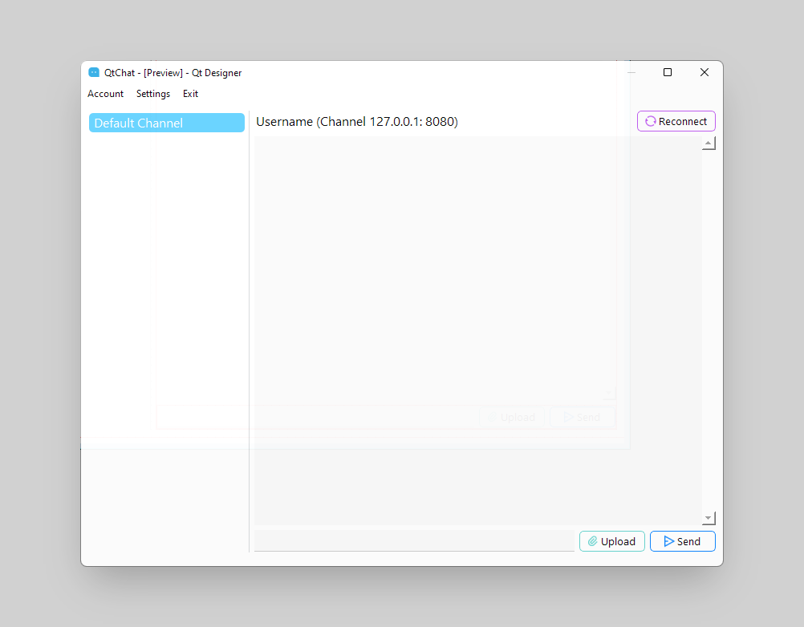
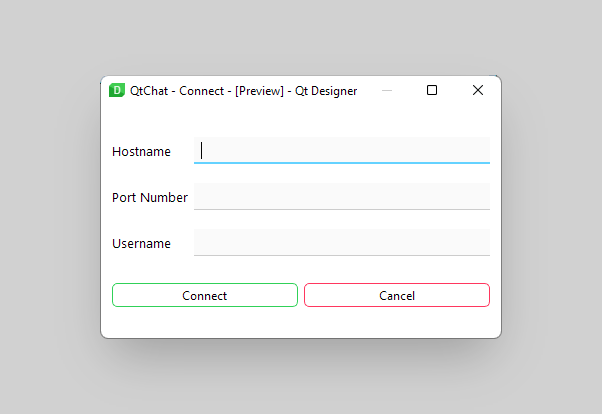

# Qt requirement
- Python: 3.6+ 

- Qt: 6.0+ 

- CMake: 3.18+ 

- Git: 2.0+. 

- libclang: The libclang library, recommended: version 10 for 6.0+. 

## Ouput command
python -m PyQt6.uic.pyuic -x main_window.ui -o main_window.py

python -m PyQt6.uic.pyuic -x connect_window.ui -o connect_window.ui.py

## Screenshots

